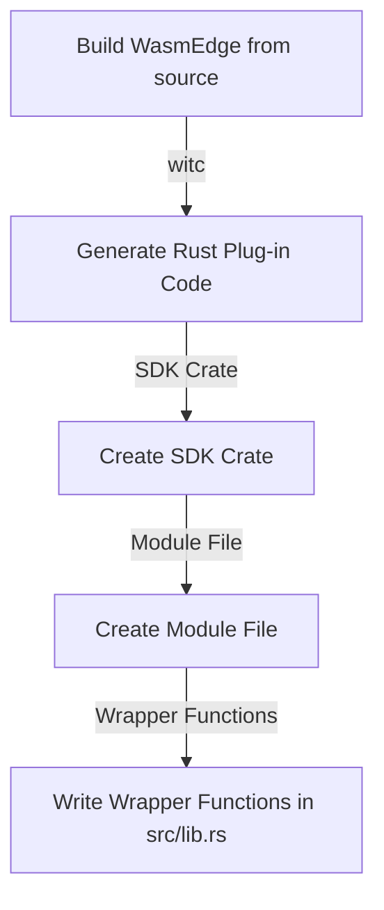

## Subject: Application for mentee position for the project [ CNCF - WasmEdge: Integrate burn.rs as a new WASI-NN backend](https://mentorship.lfx.linuxfoundation.org/project/16b35930-5b29-43af-b02c-cdf851069c85)

Dear Potential Mentors,

I hope this message finds you well. I am writing to express my keen interest in contributing to the CNCF Community and taking on the challenge of implementing burn.rs. After carefully reviewing the project description and understanding its significance, I am excited about the opportunity to collaborate with the team and make a meaningful impact.
Having studied the project's outlined goals:
```
1. New plugin provides a burn.rs WASI-NN 
2. A test suite for validating the plugin
3. Documents and examples for explaining how to use the plugin
```
I am applying to the project for learning and being mentored in order to be proficient in Rust and being acquainted to working with large and significant code base of WASM so that in long term I can be significant contributor or maintainer. By the end of mentorship program I wish to acquire following skills and experiences:
```
1. Being mentored by maintainers for writing quality code 
2. Learning how to write tests for a project
3. Using features of burn.rs and WASI-NN
4. Coding proficiency in Rust, and being able to write quality and well documented code
```
Relevant skills I posess for being a quality candidate are 
```
1. I can write good Markdowns and guides which will prove to be helpful for future contributors
2. Writing useful tests for the project
3. Being able to follow instructions and documentations provided
4. Updating the code as suggested by the maintainers positively and following the code reviews
```
I have given the [ pre-test ](https://github.com/souravpy/LFX-Mentorship-WasmEdge-2024-01-Pre-test) provided by the maintainers and successfully compiled and run burn.rs, rustls, and WASM examples successfully, understood that burn.rs is more faster and efficient, also its need to be implemented. 

I studied the documentation for [Develop WasmEdge Plug-in in Rust SDK with witc](https://wasmedge.org/docs/contribute/plugin/develop_plugin_rustsdk/) and grasped a basic idea of developing building a plugin.

We can can extend the functionality of WasmEdge and customize it to suit specific needs. WasmEdge provides a Rust-based API for registering extension modules and host functions.

## Flow for developing the burn.rs plugin


I have successfully setup my work environment by building WasmEdge from the source using witc to generate Plug-in SDK along with the build environment.

We can write the ```burn.rs``` plugin
To develop a WasmEdge Plug-in in Rust using the witc tool, you can follow these steps:

- **Writing ```wasmedge_burn.wit```**
We can see the example of ```wasmedge_opencvmini.wit``` and create the file with certain modifications to support it.
```
type mat-key = u32

imdecode: func(buf: list<u8>) -> mat-key
imencode: func(ext: string, m: mat-key, buf: list<u8>) -> unit
imwrite: func(file-name: string, m: mat-key) -> unit

imshow: func(window-name: string, m: mat-key) -> unit
waitkey: func(delay: u32) -> unit

blur: func(m: mat-key, kernel-width: u32, kernel-height: u32) -> mat-key
bilinear-sampling: func(m: mat-key, w: u32, h: u32) -> mat-key
cvt-color: func(m: mat-key, code: s32, dest-channel: s32) -> mat-key
resize: func(m: mat-key, w: u32, h: u32, interpolation: u32) -> mat-key
normalize: func(m: mat-key, alpha: u32, beta: u32, norm-type: u32, dtype: u32, mask: mat-key) -> mat-key
no-array: func() -> mat-key

rectangle: func(m: mat-key, top: u32, left: u32, bottom: u32, right: u32, R: f64, G: f64, B: f64, thickness: s32, lineType: s32, shift: s32) -> unit
```

- **Generate Rust Plug-in Code**: Considering we have a file named `wasmedge_burn.wit` with the following content:

  ```wit
  imdecode: func(buf: list<u8>) -> u32
  imshow: func(window-name: string, mat-key: u32) -> unit
  waitkey: func(delay: u32) -> unit
  ```

  You can use the witc tool to generate Rust plug-in code for it by running the following command:

  ```shell
  witc plugin wasmedge_burnrs.wit
  ```

- **Create SDK Crate**: You need to create an SDK crate for your plug-in. Run the following command to create a new crate named `burn-sdk`:

  ```shell
  cargo new --lib burnrs-sdk && cd burnrs-sdk
  ```

- **Create Module File**: The witc tool puts the Rust code to stdout. To capture the generated code, create a new module file named `src/generated.rs` and run the following command:

  ```shell
  witc plugin wasmedge_burnrs.wit > src/generated.rs
  ```

- **Write Wrapper Functions**: In the `src/lib.rs` file of your crate, write the following code of `mod generated` to access the generated code and create wrapper functions:

  ```rust
  mod generated;

  pub fn imdecode(buf: &[u8]) -> u32 {
      unsafe { generated::imdecode(buf.as_ptr(), buf.len()) }
  }
  pub fn imshow(window_name: &str, mat_key: u32) -> () {
      unsafe { generated::imshow(window_name.as_ptr(), window_name.len(), mat_key) }
  }
  pub fn waitkey(delay: u32) -> () {
      unsafe { generated::waitkey(delay) }
  }
  ```

  This code imports the generated module and provides safe wrapper functions for each generated function.


